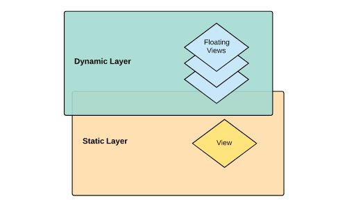

RobotlegsJS Pixi Palidor Extension
===

[](https://gitter.im/RobotlegsJS/RobotlegsJS)
[](https://travis-ci.org/RobotlegsJS/RobotlegsJS-Pixi-Palidor)
[](https://codebeat.co/projects/github-com-robotlegsjs-robotlegsjs-pixi-palidor-master)
[](https://codeclimate.com/github/RobotlegsJS/RobotlegsJS-Pixi-Palidor/coverage)
[](https://badge.fury.io/js/%40robotlegsjs%2Fpixi-palidor)
[](https://greenkeeper.io/)
[](https://github.com/prettier/prettier)

Palidor is an extension of RobotlegsJS for Pixi, designed to help the management of the Main Container, taking the responsibility to add, remove and, switch the views. Perfect for game development.

Installation
===

You can get the latest release of Palidor and its dependencies using npm:

```
npm install @robotlegsjs/pixi-palidor @robotlegsjs/core @robotlegsjs/pixi pixi.js
```
**Dependencies**

+ [RobotlegsJS](https://github.com/RobotlegsJS/RobotlegsJS)
+ [RobotlegsJS-Pixi](https://github.com/RobotlegsJS/RobotlegsJS-Pixi)
+ [PixiJS](https://www.pixijs.com/)

Usage
===
Palidor was designed to be simple and, practical. You just need to follow three steps to start to use.

### Step 1 - Install/Configure

Firstly, you need to instantiate your RobotlegsJS's context, and then install and configure the PalidorPixiExtension and a PixiRootContainer.

```ts
let stage = new PIXI.Container();
let context = new Context()
    .install(PalidorPixiExtension)
    .configure(new PixiRootContainer(this.stage))
    .configure(PalidorConfig)
    .initialize();
```
+ **PalidorPixiExtension:** It is the extension itself.
+ **PixiRootContainer:** It is the class responsible for register the Main Container.
+ **PalidorConfig:** The Class that implements the Robotlegs's IConfig and will be responsible for map all Views and FloatingViews.

### Step 2 - Mapping the Views/FloatingViews

In the Second step, you must map all views that you need. Palidor works with two types of views (FloatingViews and Views) and the main difference between them is the way that Palidor will add it on the Stage.

Palidor splits the Main Container into two distinct Layers, one to each type of View. The FloatingView always will be in a layer above the others Views.



+ **View:** A View is a screen added into the Static Layer which is behind all FloatingViews. Palidor allows only one View per time and will remove the current view before to add a new View.
+ **FloatingView:** A FloatingView is a screen added into the Dynamic Layer and always will be above the view and also others FloatingViews. Palidor allows any number of FloatingView that you want. FloatingViews is the best choice to create temporary views such as AlertsScreen, PauseScreen, GameOverScreen and Popups.

The FlowManager will be the responsible to tells to Palidor each event mapped to each View.

```ts
import { IFlowManager } from "@robotlegsjs/pixi-palidor";
import { IConfig, injectable, inject } from "@robotlegsjs/core";

@injectable()
export class MyPalidorConfig implements IConfig {
    @inject(IFlowManager)
    public flowManager: IFlowManager;

    public configure(): void {
        this.flowManager.map( CustomEvent.SHOW_FIRST_VIEW ).toView( FirstView );
        this.flowManager.map( CustomEvent.SHOW_FIRST_FLOATING_VIEW ).toFloatingView( FirstFloatingView );
    }
}
```

### Step 3 - Adding a View

The last part it is the way that Palidor will add the views on the stage, you just need to dispatcher an event using the IEventDispatcher which is available for Injection like any other Robotlegs Command.

```ts
this.eventDispatcher.dispatchEvent(new CustomEvent(CustomEvent.SHOW_FIRST_VIEW));
```

#### Events

There are some predefined events on the  Palidor to help to remove a view or floating view from the stage.

+ PalidorEvent.REMOVE_CURRENT_VIEW:
+ PalidorEvent.REMOVE_ALL_FLOATING_VIEWS:
+ PalidorEvent.REMOVE_LAST_FLOATING_VIEW_ADDED:

Examples
===


+ [Game - Battleship](https://github.com/RonaldoSetzer/GAME-Battleship)
+ [Game - Minesweeper](https://github.com/RonaldoSetzer/GAME-Minesweeper)
+ [Game - Space Invaders](https://github.com/RonaldoSetzer/GAME-SpaceInvaders)
+ [Game - Tetris](https://github.com/RonaldoSetzer/GAME-Tetris)
+ [Game - Match 3](https://github.com/RonaldoSetzer/GAME-Match3)

License
---

[MIT](LICENSE)